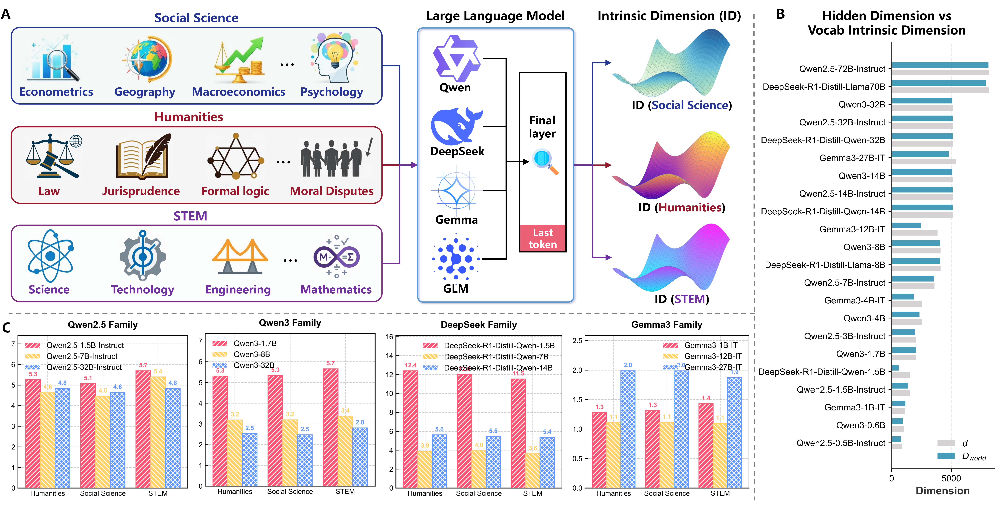
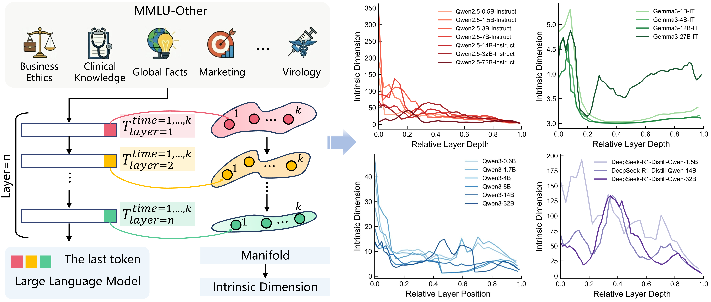

# Reasoning Emerges from Constrained Inference Manifolds in Large Language Models

<p align="center">
  <a href="https://arxiv.org/abs/2605.08142"></a>
</p>

<p align="center">
  
</p>

We study reasoning in large language models as an intrinsic dynamical process by examining the evolution of internal representations during inference. Effective reasoning dynamics emerge within a constrained structural regime characterised by three conditions:

1. **Representational expressivity** — `D_world`, the intrinsic dimension of the static vocabulary-embedding matrix.
2. **Spontaneous manifold compression** — `D_stim`, the stimulus-induced intrinsic dimension of inference-time trajectories at the final layer.
3. **Preservation of non-degenerate information volume** — `V`, the volume of the centred trajectory matrix at the final layer.

A single label-free diagnostic summarises reasoning health (Eq. 15):

```
H = log(D_world) · V / exp(ε · D_stim),     ε = 0.1
```

## Installation

```bash
git clone https://github.com/Reasoning-Manifold/Reasoning-Manifold.git
cd Reasoning-Manifold
```

Pick **one** of the two environment managers below.

### Conda

```bash
conda create -n reasoning-manifolds python=3.10 -y
conda activate reasoning-manifolds

# Install PyTorch (adjust CUDA version as needed)
pip install torch==2.4.0 --index-url https://download.pytorch.org/whl/cu121

# Install runtime dependencies
pip install "accelerate>=1.0" "numpy>=1.26" "pandas>=2.2" \
            "perceptual-manifold-geometry>=0.1.4" \
            "tqdm>=4.66" "transformers>=4.45"

cd src   # every command in the rest of this README is run from here
```

### uv

```bash
# Install uv (https://docs.astral.sh/uv) if you do not have it yet
curl -LsSf https://astral.sh/uv/install.sh | sh

uv venv --python 3.10
source .venv/bin/activate

# Install PyTorch (adjust CUDA version as needed)
uv pip install torch==2.4.0 --index-url https://download.pytorch.org/whl/cu121

# Install runtime dependencies
uv pip install "accelerate>=1.0" "numpy>=1.26" "pandas>=2.2" \
               "perceptual-manifold-geometry>=0.1.4" \
               "tqdm>=4.66" "transformers>=4.45"

cd src   # every command in the rest of this README is run from here
```

## Data Format

Stimuli are read from JSONL files. Each line is a single question:

```json
{"id": "mmlu-other-0", "question": "...", "choices": ["A", "B", "C", "D"], "answer": "B"}
```

Field aliases are accepted to keep MMLU / AIME / GPQA dumps interchangeable:
`question | problem | Question`, `answer | solution | ground_truth | Correct Answer`,
optional `choices`.

## Reproducing Paper Results

### Reasoning health H (multi-model, final layer)

Generate, extract last-layer hidden states across `--repeats` runs, and aggregate `D_world` / `D_stim` / `V` / `H` in one shot:

```bash
python -m pipelines.run \
    --model Qwen/Qwen3-8B \
    --dataset path/to/stimuli.jsonl \
    --config qwen3 \
    --tp 1 --dp 1 --repeats 1 \
    --output-dir results/qwen3-8b/
```

The launcher spawns `tp × dp` worker processes (one subprocess per `--dp` group of GPUs) and writes:

```
results/qwen3-8b/<dataset-stem>/
├── metrics.json        # D_world, D_stim, V, H — summary + per-repeat
├── report.md           # human-readable table
└── predictions/        # per-repeat model completions (JSONL)
```

Available decoding families: `qwen3`, `qwen2.5`, `deepseek`, `gemma3`, `greedy`
(parameters mirror those used in the paper).

### Layer-wise ID and V

<p align="center">
  
</p>

Reproducing the per-layer curves is a three-step pipeline:

```bash
# 1. Dump per-sample, per-layer hidden states
python -m pipelines.layerwise \
    --model Qwen/Qwen3-8B \
    --dataset path/to/stimuli.jsonl \
    --config qwen3 \
    --output-dir results/layerwise/

# 2. Convert .pt dumps into a per-layer ID/V CSV
python -m pipelines.layer_metrics \
    --states-dir results/layerwise/Qwen3-8B/<dataset-stem>/states \
    --output-dir results/layer_metrics/

# 3. Merge per-model CSVs into one table
python -m pipelines.merge_metrics \
    --root   results/layer_metrics/ \
    --glob   '*_metrics.csv' \
    --output results/all_models.csv
```

## Python API

The three core measures are importable directly (run from `src/`):

```python
from core import (
    intrinsic_dimension,   # TLE, k=20
    information_volume,    # ½ log det( I + (d/m) ZᵀZ )
    reasoning_health,      # H = log(D_world)·V / exp(ε·D_stim)
)

D_world = intrinsic_dimension(vocab_embeddings)          # (vocab, hidden)
D_stim  = intrinsic_dimension(trajectory)                # (tokens, hidden)
V       = information_volume(trajectory)
H       = reasoning_health(D_world, D_stim, V)
```

## Repository Layout

```
Reasoning-Manifold/
├── README.md
├── LICENSE
├── pyproject.toml                     dependency manifest (no install required)
├── assets/                            figures
└── src/
    ├── utils.py                       seeding, GPU allocation, logging
    ├── core/                          the paper's measures and stimuli
    │   ├── metrics.py                   D_world / D_stim / V / H
    │   └── data.py                      JSONL stimulus loader
    ├── inference/                     HF inference-time machinery
    │   ├── models.py                    model loader (Qwen / DeepSeek / Gemma3)
    │   ├── decoding.py                  per-family decoding parameters
    │   ├── prompts.py                   prompt templates (MMLU / GPQA)
    │   └── extract.py                   forward-hook hidden-state collector
    └── pipelines/                     CLI entry points
        ├── run.py                       python -m pipelines.run           multi-GPU launcher
        ├── _worker.py                     ↳ per-process extractor
        ├── _aggregate.py                  ↳ D_stim / V / H aggregator
        ├── layerwise.py                 python -m pipelines.layerwise     per-layer dump
        ├── layer_metrics.py             python -m pipelines.layer_metrics .pt → CSV
        └── merge_metrics.py             python -m pipelines.merge_metrics merge CSVs
```

## Citation

```bibtex
@article{ma2026reasoning,
  title   = {Reasoning emerges from constrained inference manifolds in large language models},
  author  = {Ma, Yanbiao and Luo, Fei and Zhang, Linfeng and Zhao, Chuangxin and Wang, Mingxuan
             and Wu, Yinan and Qian, Zhe and Lu, Yang and Chen, Long and Cao, Zhao
             and Hao, Xiaoshuai and Wen, Ji-Rong and Han, Jungong},
  journal = {arXiv preprint arXiv:2605.08142},
  year    = {2026}
}
```

## Acknowledgement

The geometric analyses build on the [`perceptual-manifold-geometry`](https://pypi.org/project/perceptual-manifold-geometry/) package for intrinsic-dimension, curvature, and density estimation on high-dimensional point clouds.

## License

MIT — see [`LICENSE`](LICENSE).
